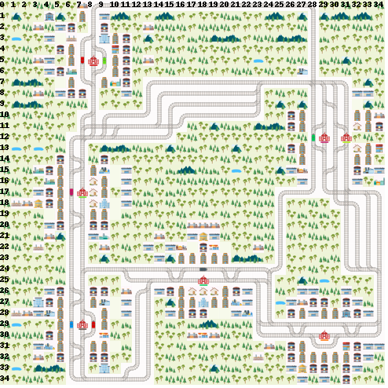
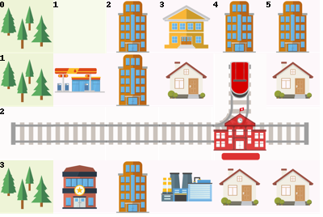

Level Generation
================

## Rail Generators, Line Generators and Timetable Generators
The separation between rail generation and schedule generation reflects the organisational separation in the railway domain
- Infrastructure Manager (IM): is responsible for the layout and maintenance of tracks simulated by `rail_generator`.
- Railway Undertaking (RU): operates trains on the infrastructure
Usually, there is a third organisation, which ensures discrimination-free access to the infrastructure for concurrent requests for the infrastructure in a **schedule planning phase** simulated by `line_generator` and `timetable_generator`.
However, in the **Flat**land challenge, we focus on the re-scheduling problem during live operations. So, 

Technically `rail_generator`, `line_generator` and the `timetable_generator` are implemented as follows 
```python
RailGeneratorProduct = Tuple[GridTransitionMap, Optional[Any]]
RailGenerator = Callable[[int, int, int, int], RailGeneratorProduct]

AgentPosition = Tuple[int, int]

Line = collections.namedtuple('Line',  [('agent_positions', IntVector2DArray),
                                        ('agent_directions', List[Grid4TransitionsEnum]),
                                        ('agent_targets', IntVector2DArray),
                                        ('agent_speeds', List[float]),
                                        ('agent_malfunction_rates', List[int])])

LineGenerator = Callable[[GridTransitionMap, int, Optional[Any], Optional[int]], Line]

Timetable = collections.namedtuple('Timetable',  [('earliest_departures', List[int]),
                                                  ('latest_arrivals', List[int]),
                                                  ('max_episode_steps', int)])

timetable_generator = Callable[[List[EnvAgent], DistanceMap, dict, RandomState], Timetable]
```

We can then produce `RailGenerator`s by completing the following:
```python
def sparse_rail_generator(max_num_cities=5, grid_mode=False, max_rails_between_cities=4,
                          max_rail_pairs_in_city=4, seed=0):

    def generator(width, height, num_agents, num_resets=0):

        # generate the grid and (optionally) some hints for the line_generator
        ...

        return grid_map, {'agents_hints': {
            'num_agents': num_agents,
            'city_positions': city_positions,
            'train_stations': train_stations,
            'city_orientations': city_orientations
        }}

    return generator
```
similarly, `LineGenerator`s:
```python
def sparse_line_generator(speed_ratio_map: Mapping[float, float] = None) -> LineGenerator:
    def generator(rail: GridTransitionMap, num_agents: int, hints: Any = None):
        # place agents:
        # - initial position
        # - initial direction
        # - targets
        # - speed data
        # - malfunction data
        ...

        return agents_position, agents_direction, agents_target, speeds, agents_malfunction

    return generator
```

And finally, `timetable_generator` is called within the `RailEnv`'s reset() during line generation to create a time table for the trains.

```python
def timetable_generator(agents: List[EnvAgent], distance_map: DistanceMap, 
                            agents_hints: dict, np_random: RandomState = None) -> Timetable:
    # specify:
    # - earliest departures
    # - latest arrivals
    # - max episode steps
    ...

    return Timetable(earliest_departures, latest_arrivals, max_episode_steps)
```

Notice that the `rail_generator` may pass `agents_hints` to the  `line_generator` and `timetable_generator` which the latter may interpret.
For instance, the way the `sparse_rail_generator` generates the grid, it already determines the agent's goal and target.
Hence, `rail_generator`, `line_generator` and  `timetable_generator` have to match if `line_generator` presupposes some specific `agents_hints`.
Currently, the only one used are the `sparse_rail_generator`, `sparse_line_generator` and the `timetable_generator` which works in conjunction with these.
______________
## Available Rail Generators

Flatland provides multiple ways to create random environments. The most important one is the [`sparse_rail_generator`](https://gitlab.aicrowd.com/flatland/flatland/blob/master/flatland/envs/rail_generators.py#L563), which generates realistic-looking railway networks.

Sparse rail generator
---------------------

The idea behind the sparse rail generator is to mimic classic railway structures where dense nodes (cities) are sparsely connected to each other and where you have to manage traffic flow between the nodes efficiently.
The cities in this level generator are much simplified in comparison to real city networks but they mimic parts of the problems faced in daily operations of any railway company.



There are a number of parameters you can tune to build your own map and test different complexity levels of the levels.

```{note}
Some combinations of parameters do not go well together and will lead to infeasible level generation.
In the worst case, the level generator will issue a warning when it cannot build the environment according to the parameters provided.
```

To build an environment, instantiate a `RailEnv` as follow:

```python
rail_generator=sparse_rail_generator(
    max_num_cities=5,
    grid_mode=False,
    max_rails_between_cities=4,
    max_rail_pairs_in_city=4, 
    seed=0
)

env = RailEnv(
    width=50, height=50,
    rail_generator=rail_generator,
    line_generator=sparse_line_generator(),
    number_of_agents=10
)

env.reset()
```

You can see that you now need both a `rail_generator` and a `line_generator` to generate a level. These need to work nicely together. The `rail_generator` will generate the railway infrastructure and provide hints to the `line_generator` about where to place agents. The `line_generator` will then generate a Line by placing agents at different train stations and providing them with individual targets.

You can tune the following parameters in the `sparse_rail_generator`:

- `max_num_cities`: Maximum number of cities to build. The generator tries to achieve this numbers given all the other parameters. Cities are the only nodes that can host start and end points for agent tasks (train stations). 

- `grid_mode`: How to distribute the cities in the path, either equally in a grid or randomly.

- `max_rails_between_cities`: Maximum number of rails connecting cities. This is only the number of connection points at city border. The number of tracks drawn in-between cities can still vary.

- `max_rails_in_city`: Maximum number of parallel tracks inside the city. This represents the number of tracks in the train stations.

- `seed`: The random seed used to initialize the random generator. Can be used to generate reproducible networks.


<!-- Manually specified railway
--------------------------

It is possible to manually design railway networks using [`rail_from_manual_specifications_generator`](https://gitlab.aicrowd.com/flatland/flatland/blob/master/flatland/envs/rail_generators.py#L182).

It accepts a list of lists whose each element is a 2-tuple, whose entries represent the `cell_type` (see `core.transitions.RailEnvTransitions`) and the desired clockwise rotation of the cell contents (0, 90, 180 or 270 degrees):

```python
specs = [[(0, 0), (0, 0), (0, 0), (0, 0), (0, 0), (0, 0)],
         [(0, 0), (0, 0), (0, 0), (0, 0), (7, 0), (0, 0)],
         [(7, 270), (1, 90), (1, 90), (1, 90), (2, 90), (7, 90)],
         [(0, 0), (0, 0), (0, 0), (0, 0), (0, 0), (0, 0)]]

env = RailEnv(width=6, height=4,
              rail_generator=rail_from_manual_specifications_generator(specs),
              number_of_agents=1
env.reset()
```

 -->

