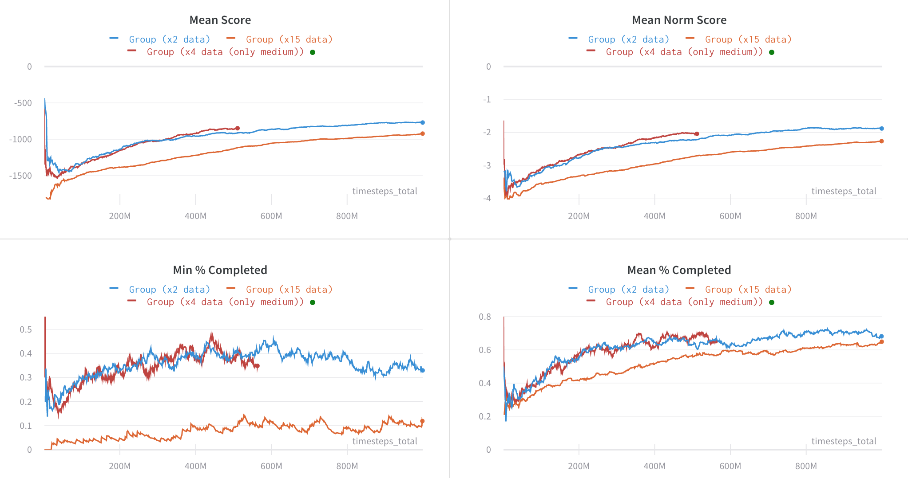

Welcome to Flatland
===

```{admonition} Ongoing Challenge
Join the [NeurIPS 2020 Flatland Challenge](https://www.aicrowd.com/challenges/neurips-2020-flatland-challenge/) on AIcrowd!
```

Flatland is an open-source toolkit for developing and comparing Multi Agent Reinforcement Learning algorithms in little (or ridiculously large!) gridworlds.


[](https://gitlab.aicrowd.com/flatland/flatland) 
[](https://gitlab.aicrowd.com/flatland/flatland) 
[](https://gitter.im/AIcrowd-HQ/flatland-rl)


Getting started
---

Using the environment is easy whether you’re a human or an AI:

```console
$ pip install flatland-rl
$ flatland-demo # human
$ python <<EOF # random RL agent
import gym
env = RailEnv(width=16, height=16)
obs = env.reset()
while True:
    obs, rew, done, info = env.step(env.action_space.sample())
    env.render()
    if done:
        break
EOF
```

**[Make your first Challenge submission in 5 minutes!](first-submission)**

To learn about Flatland in more details, read about [how to interact with this environment](flatland-env), how to get started with [reinforcement learning methods](flatland-rl) or with [operations research methods](flatland-or). 

Design principles
---

- **Real-word, high impact problem** 

The Swiss Federal Railways (SBB) operate the densest mixed railway traffic in the world. SBB maintain and operate the biggest railway infrastructure in Switzerland. Today, there are more than 10,000 trains running each day, being routed over 13,000 switches and controlled by more than 32,000 signals. The “Flatland” Competition aims to address the vehicle rescheduling problem by providing a simplistic grid world environment and allowing for diverse solution approaches. The challenge is open to any methodological approach, e.g. from the domain of reinforcement learning or of operations research.


- **Tunable difficulty** 

All environments support well-calibrated difficulty settings. While we report results using the hard difficulty setting, we make the easy difficulty setting available for those with limited access to compute power. Easy environments require approximately an eighth of the resources to train.

- **Environment diversity** 

In several environments, it has been observed that agents can overfit to remarkably large training sets. This evidence raises the possibility that overfitting pervades classic benchmarks like the Arcade Learning Environment, which has long served as a gold standard in reinforcement learning (RL). While the diversity between different games in the ALE is one of the benchmark’s greatest strengths, the low emphasis on generalization presents a significant drawback. In each game the question must be asked: are agents robustly learning a relevant skill, or are they approximately memorizing specific trajectories?


Experimental results
---

We provide multiple baselines to get you started.



- **Ape-X**: Use a distributed prioritized DQN approach 

- **PPO**: Distributed Proximal Policy Optimisation

- **Imitation Learning**: Learn from expert demonstrations


Next steps
---

- [Use Flatland for your research](intro)

- [Take part in the NeurIPS challenge](intro)

- [Contribute to Flatland](intro)

- [Sponsor the competition](intro)


Communication
---

* [Official Documentation](http://flatland-rl-docs.s3-website.eu-central-1.amazonaws.com/)
* [Discussion Forum](https://discourse.aicrowd.com/c/flatland-challenge)
* [Issue Tracker](https://gitlab.aicrowd.com/flatland/flatland/issues/)


Contributions
---

Please follow the [Contribution Guidelines](http://flatland-rl-docs.s3-website.eu-central-1.amazonaws.com/contributing.html) for more details on how you can successfully contribute to the project. We enthusiastically look forward to your contributions.

Partners
---

<a href="https://sbb.ch" target="_blank"></a>
<a href="https://www.aicrowd.com"  target="_blank"></a>


